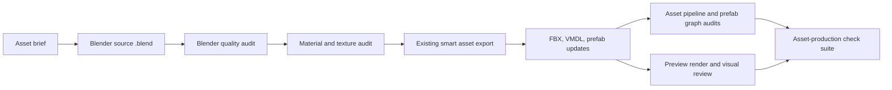

# Production Asset Toolkit Design

## Status

Approved for planning on 2026-05-13.

## Context

This project already has a Blender to S&Box pipeline:

- `.claude/settings.json` watches `.blend` saves.
- `scripts/smart_asset_export.ps1` chooses an asset-specific config or scaffolds one.
- `scripts/asset_pipeline.py` exports FBX, writes VMDL, verifies material remaps, and updates prefabs.
- `scripts/agents/asset_pipeline_audit.ps1` checks pipeline files, configs, outputs, and material remap targets.
- `.agents/sbox/asset-pipeline-agent.md` documents the current asset review path.

The missing piece is not another exporter. The missing piece is a production lane that improves asset quality before export and catches low-quality or incomplete work before it reaches S&Box.

## Goals

- Cover weapons/equipment, drones, soldier/character models, and environment/props in the first version.
- Keep one shared toolkit with category profiles instead of four unrelated pipelines.
- Add repeatable asset briefs so every model starts with role, scale, silhouette, material, and S&Box integration targets.
- Add Blender quality audits for hierarchy, naming, scale, transforms, mesh quality, material slots, UV readiness, and category-specific requirements.
- Add material and texture audits for `.vmat` files and texture references.
- Generate visual review artifacts that make model quality easier to judge before an editor playtest.
- Extend the current agent toolkit and check runner instead of replacing it.
- Preserve existing public S&Box class, prefab, and asset names unless a future task explicitly asks to rename them.

## Non-Goals

- No gameplay, UI, networking, or prefab hierarchy rewrites.
- No automatic replacement of every existing model in this first pass.
- No dependency on Chrome. The browser companion is optional and the in-app browser is the working surface.
- No mandatory online AI image or model generation. The toolkit may support reference-driven work, but local Blender and S&Box validation remain the source of truth.
- No destructive cleanup of existing `.blend`, FBX, VMDL, prefab, or material assets.

## Design Overview

Build a production asset toolkit with one shared core and four category profiles.

The shared core defines the development lane:

1. Brief the asset.
2. Build or refine the model in Blender.
3. Audit Blender scene quality.
4. Audit material and texture completeness.
5. Export through the existing pipeline.
6. Validate S&Box integration files.
7. Generate preview renders and review notes.
8. Run the existing agent checks before handoff.

Category profiles add specific expectations without duplicating the pipeline:

- Weapon/equipment profile.
- Drone profile.
- Character profile.
- Environment/prop profile.

## Agents

### Asset Brief Agent

Purpose: create or review a brief before modeling starts.

Responsibilities:

- Capture asset name, category profile, gameplay role, desired visual quality, target prefab, target model path, material plan, scale target, and sockets or attachment points.
- For replacement assets, record the current prefab/model being replaced and the acceptance criteria that prove the replacement did not break gameplay wiring.
- For new assets, record the expected `scripts/<asset>_asset_pipeline.json` and whether AutoWire needs future changes.

Primary files:

- `.agents/sbox/asset-brief-agent.md`
- `docs/assets/briefs/<asset-name>.md`
- `scripts/agents/new_asset_brief.ps1`

### Blender Model Quality Agent

Purpose: inspect source `.blend` files before export.

Responsibilities:

- Run Blender headless to inspect scene objects, meshes, materials, UV layers, transforms, dimensions, parent hierarchy, and root object choice.
- Flag unapplied transforms, missing mesh UVs when textured materials are planned, missing material slots, empty or tiny meshes, suspicious scale, missing root objects, and accidental camera/light-only scenes.
- Apply category profile rules such as required weapon muzzle socket, drone propeller/camera parts, character rig or attachment readiness, and prop collision notes.

Primary files:

- `.agents/sbox/blender-quality-agent.md`
- `scripts/blender_asset_audit.py`
- `scripts/agents/blender_quality_audit.ps1`
- `scripts/asset_quality_profiles.json`

### Material and Texture Agent

Purpose: catch flat-grey and incomplete material output before S&Box playtest.

Responsibilities:

- Parse `.vmat` files referenced by asset configs.
- Check for `TextureColor`, `TextureNormal`, `TextureRoughness`, and `TextureAmbientOcclusion` according to the selected profile.
- Flag missing files, accidental `materials/default/default_color.tga`, and stale or mismatched material remap names.
- Keep strict errors for missing color textures and warnings for optional texture maps unless the profile says otherwise.

Primary files:

- `.agents/sbox/material-texture-agent.md`
- `scripts/agents/material_texture_audit.ps1`
- Extensions to `scripts/agents/asset_pipeline_audit.ps1` where that avoids duplicate parsing.

### Export and Integration Agent

Purpose: keep the current Blender to S&Box path reliable.

Responsibilities:

- Continue using `scripts/smart_asset_export.ps1` and `scripts/asset_pipeline.py` as the export path.
- Extend `scripts/agents/run_agent_checks.ps1` with an `asset-production` suite that runs quality, material, pipeline, prefab graph, and readiness checks.
- Ensure generated FBX/VMDL/prefab files stay under the existing `Assets/` conventions.
- Ensure prefab updates are limited to renderer model/material fields unless a future task explicitly approves prefab restructuring.

Primary files:

- Existing `.agents/sbox/asset-pipeline-agent.md`
- `scripts/agents/run_agent_checks.ps1`
- `scripts/agents/asset_pipeline_audit.ps1`
- `scripts/agents/feature_readiness_report.ps1`

### Visual Review Agent

Purpose: make visual quality review repeatable instead of relying only on memory or editor screenshots.

Responsibilities:

- Generate preview renders for `.blend` assets through Blender background mode.
- Create a contact sheet or per-asset preview under ignored local output such as `screenshots/asset_previews/`.
- Record review notes: silhouette readability, material separation, scale confidence, profile-specific concerns, and S&Box editor acceptance steps.
- Keep preview output local and ignored by git unless the user explicitly asks to track a specific image.

Primary files:

- `.agents/sbox/visual-review-agent.md`
- `scripts/render_asset_preview.py`
- `scripts/agents/asset_visual_review.ps1`
- `docs/assets/reviews/<asset-name>.md`

## Category Profiles

### Weapon and Equipment

Checks:

- Clear root object or combined export target.
- Correct scale for first-person and world rendering.
- Muzzle or functional socket note when the asset fires or emits effects.
- Grip/attachment orientation notes for soldier prefab mounting.
- Material separation for metal, polymer, rubber, markings, glass, LEDs, or other readable surfaces.
- Standalone prefab target when the asset is attachable equipment.

### Drones

Checks:

- Readable silhouette from gameplay distance.
- Distinct variant identity for GPS, FPV, and fiber FPV assets.
- Propeller, motor, frame, camera, lens, antenna, and LED material groups when present.
- Reasonable origin and scale for flight controller visuals.
- Collision and gameplay components remain owned by prefab/code, not by the visual audit.

### Soldier and Character Models

Checks:

- Character scale and proportions match the existing ground controller assumptions.
- Rig, armature, or attachment readiness is recorded if the model is animated.
- Material groups separate clothing, armor, skin, gloves, visor, gear, and team/class accents as needed.
- Existing SoldierBase subclass prefab identities remain unchanged.
- Replacement assets document expected first-person and third-person visibility risks.

### Environment and Props

Checks:

- Scale and origin are sensible for scene placement.
- Repeated props have stable names and avoid accidental giant bounds.
- Collision expectations are recorded separately from visual mesh export.
- `models/dev/box.vmdl` blockout replacement work remains separated from Blender visual asset work.
- Composed-box environment prefab collider sync remains handled by `scripts/sync_box_colliders_to_renderers.ps1`.

## Data Flow

## Error Handling

- Missing source `.blend`: error.
- Missing material remap target: error.
- Remapped material using default color texture: error unless explicitly allowed in config.
- Missing optional normal, roughness, or AO texture: warning unless profile requires it.
- Missing root object with multiple top-level meshes: warning unless the config exports all top-level objects intentionally.
- Unapplied scale or rotation: warning, elevated to error if it creates suspicious exported bounds.
- Missing profile-specific socket or part: warning when visual-only, error when the asset brief marks it as required.
- Stale editor logs remain informational only unless they clearly match the current run.

## Testing and Verification

Static/tooling verification:

- `powershell -ExecutionPolicy Bypass -File scripts/agents/blender_quality_audit.ps1`
- `powershell -ExecutionPolicy Bypass -File scripts/agents/material_texture_audit.ps1`
- `powershell -ExecutionPolicy Bypass -File scripts/agents/asset_pipeline_audit.ps1`
- `powershell -ExecutionPolicy Bypass -File scripts/agents/run_agent_checks.ps1 -Suite asset-production`
- `powershell -ExecutionPolicy Bypass -File scripts/agents/test_full_automation_layer.ps1`

Build/editor verification after C# or prefab-affecting changes:

- `dotnet build Code\dronevsplayers.csproj --no-restore`
- `powershell -ExecutionPolicy Bypass -File scripts/agents/current_log_audit.ps1 -RequireFresh` after an editor playtest when fresh logs are available.

Manual S&Box verification:

- Save the `.blend`, confirm the hook exports or run the pipeline manually.
- Confirm S&Box reloads the asset.
- Confirm no missing model or error material appears.
- Confirm the prefab still mounts correctly for its category.
- For gameplay-mounted assets, do a focused playtest using the existing class or drone that owns the asset.

## Implementation Phases

1. Add profile data and brief tooling.
2. Add Blender quality audit.
3. Add material and texture audit.
4. Extend agent docs and check runner.
5. Add visual preview review tooling.
6. Run self-tests, asset-production suite, and existing full automation layer.

Each phase should be independently testable and should avoid mixing gameplay, UI, networking, prefab restructuring, and asset tooling changes.
